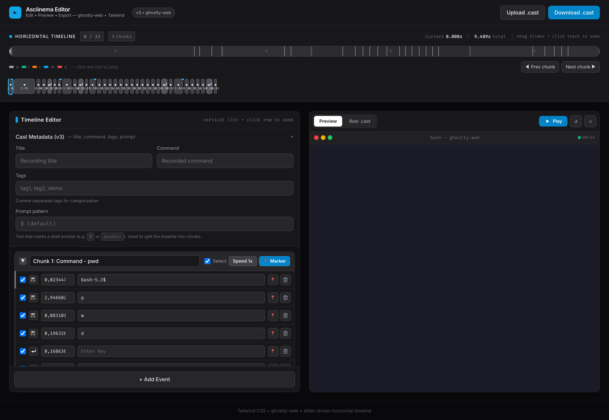
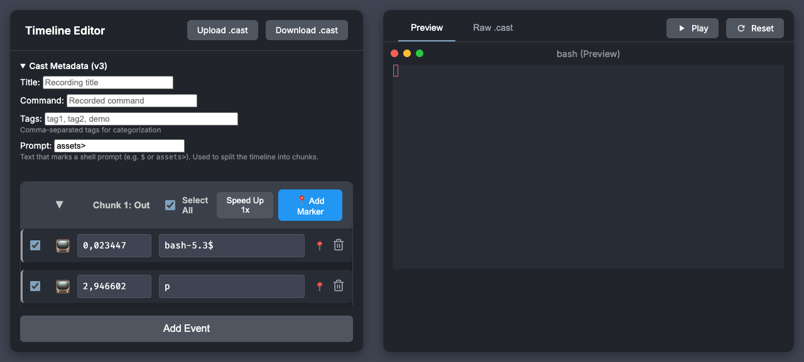

# Asciinema Editor

A desktop (Wails) + browser editor for asciinema cast files. Edit event timing and output, preview the recording in a terminal, then save an updated `.cast` file.

## Features

- Support for asciinema v3 format with metadata preservation
- Chunk-based editing with collapsible sections
- Horizontal timeline with slider + filmstrip for scrubbing and seeking
- Terminal preview with ghostty-web (WASM VT100, xterm.js API)
- Tailwind CSS UI
- Native open/save dialogs in the desktop app (no browser needed)
- Comment support in v3 format
- Configurable prompt detection for chunk splitting (e.g. `$` or `assets>`)

## Editor Overview



The left panel is the timeline editor. The right panel provides terminal playback and a synchronized Raw `.cast` view. The horizontal timeline above both panels provides slider scrubbing and a filmstrip of events.

## Running

### Desktop (Wails) — no browser needed

Requires Go 1.21+ and the Wails CLI (auto-installed to `./bin/wails` by the tasks below).

```bash
# run as a native desktop app
task desktop
# or
task wails:dev      # live-reload dev mode

# production desktop build for this platform (output: build/bin/)
task wails:build
```

Under the hood the desktop uses `https://wails.io` with `frontend/dist/index.html` embedded (kept in sync with `index.html`). Native dialogs are bound via `app.go` (`OpenCast` / `SaveCast`) and disk-backed drag-and-drop.

### Browser — quick iteration without Wails

```bash
task serve          # build + serve on http://localhost:8080
task dev            # with file watching
task build && ./bin/ascinemaeditor serve
go run . serve       # or directly
```

`task` (no args) now runs the desktop app. Use `task serve` / `task run` for the browser server. `PORT` / `HOST` / `ASCINEMAEDITOR_MODE=serve` still apply in server mode.

### Installing go-task / wails

```bash
go install github.com/go-task/task/v3/cmd/task@latest
# wails is installed automatically to ./bin/wails on first `task wails:*` / `task desktop`
```

## Getting Started

1. Start with `task desktop` (desktop) or `task serve` (browser).
2. For desktop: no browser required; the window opens directly. For browser: open `http://localhost:8080`.
3. Select **Upload .cast** (native dialog in desktop, file picker in browser) or drop a `.cast` file onto the window.
4. Use the **horizontal timeline slider** or filmstrip to scrub; use the vertical list to edit delays/content per event.
5. Select **Play** to check the result in the terminal preview, then **Download .cast** (browser) or save via the native dialog (desktop).

The editor accepts asciinema v3 recordings. It also imports v2 recordings and converts their absolute event timestamps to v3 interval delays when loaded.

## Using the Editor

### Edit Events

Each timeline row is one cast event.

- Change the delay field to set the interval before that event. Delays must be non-negative numbers.
- Change editable content fields to update terminal output, input, or marker text.
- Use the checkbox to choose events affected by **Speed Up**.
- Select **📍** on an event to insert a marker after it, or **Add Marker** to add one at the start of a chunk.
- Select the trash icon to remove an event. Select **Add Event** to append a blank output event.

Some control-only output events, such as a bare newline or bell, are displayed as disabled special-character rows. Output that contains visible text remains editable even when it ends with a newline.

### Preview and Raw View

- **Play** replays the edited cast with its current delays.
- Select an event row or a filmstrip block to seek the preview through that event.
- Drag the **horizontal timeline slider** or click the track/ticks to seek by playback time.
- **Loop** restarts playback from the beginning whenever it reaches the end, until toggled off or stopped.
- **Reset** clears playback and returns to the first event.
- Select **Raw .cast** to inspect the exact serialized event stream. Comments remain in the same position they will have in the downloaded file.

### Metadata and Comments

Open **Cast Metadata (v3)** to edit the recording title, command, and tags. Tags are entered as comma-separated values.

Chunk headings provide an editable primary comment. Existing comments from an uploaded cast are preserved in their original positions, including multiple comments before one event and comments between events.

## Prompt Detection

Prompt detection groups events into command-sized chunks. The default prompt is `$`; set a different prompt when the recording uses another shell or CLI suffix.



1. Open **Cast Metadata (v3)**.
2. Enter the literal prompt suffix in **Prompt**. For example, use `assets>` for a prompt ending in `assets>`, or leave it empty for the default `$` behavior.
3. The timeline regroups immediately. Existing cast comments remain anchored to their original events.

The prompt setting is stored in the browser's local storage, so it is reused the next time the editor is opened in that browser.

## Troubleshooting

- The UI is embedded in the binary (plus `frontend/dist` for Wails), so the server can be started from any directory. It serves only `/`; every other path returns 404.
- In browser mode the terminal preview requires access to the ghostty-web / Tailwind / font CDNs; editing still works but the preview may be blank if they cannot load. The desktop build has the same CDN dependency for those assets.
- Invalid cast headers or events are rejected without replacing the recording currently open in the editor. Check that each event is a JSON array containing a non-negative delay, string event type, and string data.

## Releases

Prebuilt binaries for linux/darwin (amd64 + arm64) are published on the [releases page](https://github.com/cldmnky/ascinemaeditor/releases). Download one for your platform and run it directly; the editor ships with built-in sample data so you can start editing immediately. Each release includes SHA256 checksums.

Desktop (Wails) builds are also published per tag:

- `ascinemaeditor-macos-universal.zip` — signed `.app` bundle for macOS (Intel + Apple Silicon)
- `ascinemaeditor-windows-amd64.zip` — Windows executable

To cut a release, tag `v*` and push the tag:

```bash
git tag v0.1.0 && git push origin v0.1.0
```

## File Structure

- `index.html` - Main web application (also synced to `frontend/dist/index.html` for Wails)
- `frontend/dist/index.html` - Wails asset (embedded via `app_desktop.go`)
- `main.go` - Entry point: `serve` starts the HTTP server, `-tags desktop` (or `wails dev`/`wails build`) starts the Wails desktop
- `app.go` / `app_desktop.go` / `app_nodesktop.go` - Wails bindings and `//go:embed` / build-tag split
- `wails.json` / `build/` - Wails project config and platform packaging assets
- `.github/workflows/release.yml` - Tag-triggered release build and publishing
- `go.mod` - Go module file
- `Taskfile.yml` - go-task configuration
- `bin/` - Built binaries (created by build process)
- `docs/screenshots/` - README screenshots
- `test-data/` - Sample cast files for testing
- `.gitignore` - Git ignore file
